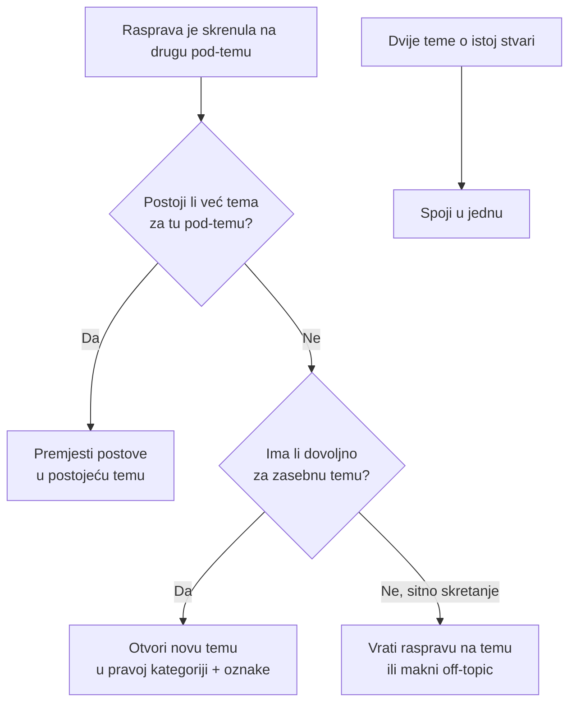

# Organizacija tema i oznaka

Ovo je srce moderacije. Cilj je da svaka rasprava završi na pravom mjestu pa ljudi lako nađu ono što traže. Kad netko pita o jednoj stvari, a rasprava skrene na drugu, moderator to posloži.

## Kategorije

Forum ima tri kategorije i svaka tema ide u jednu.

- **lijekovi** — pitanja o konkretnim lijekovima, doziranju, nuspojavama, interakcijama
- **dodaci prehrani** — vitamini, minerali, biljni dodaci i slično
- **općenito** — sve što ne spada u prethodne dvije.

Popis svih kategorija je na [forum.farmaceut.hr/categories](https://forum.farmaceut.hr/categories).

## Oznake

Oznake finije opisuju temu unutar kategorije. Izvor istine za sve oznake je [forum.farmaceut.hr/tags](https://forum.farmaceut.hr/tags).

Pravila za oznake:

- prvo provjeri postoji li već oznaka za taj pojam i koristi postojeću
- izbjegavaj duplikate i sinonime, na primjer koristi postojeću `mrsavljenje`, ne novu varijantu istog pojma
- najviše 3 do 5 oznaka po temi, biraj najrelevantnije
- oznake su malim slovom i bez kvačica u slugu, na primjer `wegovy`, `mrsavljenje`, `mentalno-zdravlje`.

Nove oznake uvodi promišljeno. Svaka suvišna varijanta razbija pretragu i otežava snalaženje.

## Kako odlučiti gdje ide rasprava

Kad rasprava unutar teme skrene na drugu pod-temu, moderator bira jedno od tri: premjestiti u postojeću temu, otvoriti novu ili spojiti dvije teme.

## Premještanje posta

Primjer: tema je "Wegovy doziranje", a netko u njoj otvori raspravu o nuspojavama.

1. Provjeri postoji li već tema o wegovy nuspojavama.
2. Ako postoji, premjesti te postove u nju.
3. Ako ne postoji, otvori novu temu (vidi niže).

Discourse koraci za premještanje:

1. Otvori temu i označi postove koji odlaze (kvačica uz post).
2. Klikni na alat za premještanje (ikona pri dnu odabira).
3. Odaberi "Premjesti u postojeću temu" i upiši ciljanu temu.
4. Potvrdi. Discourse ostavi poveznicu na novo mjesto pa korisnik zna kamo je rasprava otišla.

Nakon premještanja korisniku javi kratkom porukom, predložak je u [predlosci-poruka.md](predlosci-poruka.md).

## Otvaranje nove teme

Kad odgovarajuća tema ne postoji, a pod-tema je dovoljno velika za zaseban razgovor.

1. Odaberi pravu kategoriju, za lijek je to "lijekovi".
2. Dodaj 3 do 5 relevantnih oznaka, za wegovy nuspojave na primjer `wegovy`, `mrsavljenje`, `dijabetes`.
3. Daj temi jasan naslov koji odmah govori o čemu se radi.

Discourse koraci preko premještanja:

1. Označi postove koji čine novu pod-temu.
2. Klikni alat za premještanje i odaberi "Premjesti u novu temu".
3. Upiši naslov, postavi kategoriju i oznake.
4. Potvrdi.

## Spajanje duplih tema

Kad dvije teme pokrivaju istu stvar, spoji ih da se rasprava ne cijepa.

1. Odluči koja tema ostaje glavna, obično starija ili aktivnija.
2. Otvori temu koja se gasi i odaberi sve njezine postove.
3. Premjesti ih u glavnu temu istim alatom.
4. Provjeri oznake glavne teme i po potrebi dodaj koju iz ugašene.

Korisnicima javi da su teme spojene, predložak je u predlošcima.

## Off-topic postovi

Sitno skretanje unutar teme ne treba dramu.

- ako je kratko i bezopasno, blago vrati raspravu na temu
- ako preplavljuje temu, premjesti te postove u prikladnu ili novu temu
- ako je čisti off-topic bez vrijednosti, ukloni ga uz kratko objašnjenje.

## Cjeloviti primjer: Wegovy

Korisnik otvori temu "Wegovy doziranje" i pita o početnoj dozi. U raspravi se drugi korisnik požali na mučninu i pita je li to normalno.

1. Mučnina je nuspojava, to je druga pod-tema.
2. Provjeri postoji li tema o wegovy nuspojavama. Ako postoji, premjesti taj post u nju.
3. Ako ne postoji, otvori novu temu "Wegovy nuspojave" u kategoriji "lijekovi" s oznakama `wegovy`, `mrsavljenje`, `dijabetes`.
4. Javi korisniku kamo je rasprava premještena pa može nastaviti tamo.

Tako tema o doziranju ostaje čista, a rasprava o nuspojavama dobije svoje mjesto.
