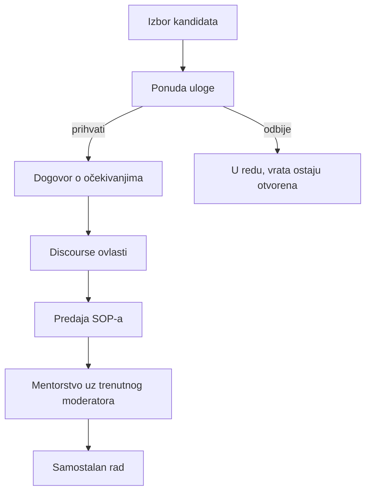

# Onboarding moderatora

Kratki vodič kako uvesti novog moderatora. Za razliku od stručnjaka, moderatore biramo iz najaktivnijih članova koji su već u zajednici pa nema provjere struke. Težište je na predaji moderacijskog SOP-a, dodjeli ovlasti i mentorstvu uz sadašnjeg moderatora.

Za sada imamo jednog moderatora. Kako forum raste, ulogu nudimo dobrim i aktivnim članovima, vjerojatno po kategorijama.

## Koga biramo

- članove koji redovito i kvalitetno sudjeluju
- one s lijepim tonom prema drugima
- ljude od povjerenja koji razumiju duh zajednice.

## Tijek

### 1. Izbor kandidata

Iz aktivnih članova izdvoji onoga tko se istakao sudjelovanjem i tonom. Mentorstvo i povjerenje su važniji od broja postova.

### 2. Ponuda uloge

Javi se toplom porukom, objasni što moderacija znači i naglasi da je dobrovoljno. Predložak je u [predlosci-poruka.md](predlosci-poruka.md).

### 3. Dogovor o očekivanjima

Kratko prođite što uloga nosi, koliko vremena traži i koju kategoriju bi pokrivao. Bez kvota, ali neka zna na što računamo.

### 4. Discourse ovlasti

1. Dodaj korisnika u moderatorsku grupu.
2. Dodijeli moderatorske ovlasti.
3. Provjeri da ima pristup redu prijava (flagovima) i alatima za teme.

### 5. Predaja SOP-a

Pošalji moderacijski SOP kao polaznu točku i prođite ga zajedno. Početak je [glavni-sop.md](../../moderiranje-foruma/glavni-sop.md), a ostatak pravila i predložaka veže se iz njega.

### 6. Mentorstvo pa samostalno

Prvih nekoliko dana radi uz sadašnjeg moderatora. Prve akcije zajedno prokomentirajte pa kad se kandidat osjeća sigurno, prelazi na samostalan rad.

## Načelo

Novi moderator ne mora znati sve odmah. Tu smo da ga uvedemo strpljivo, isto kako i on kasnije uvodi sljedećeg.
