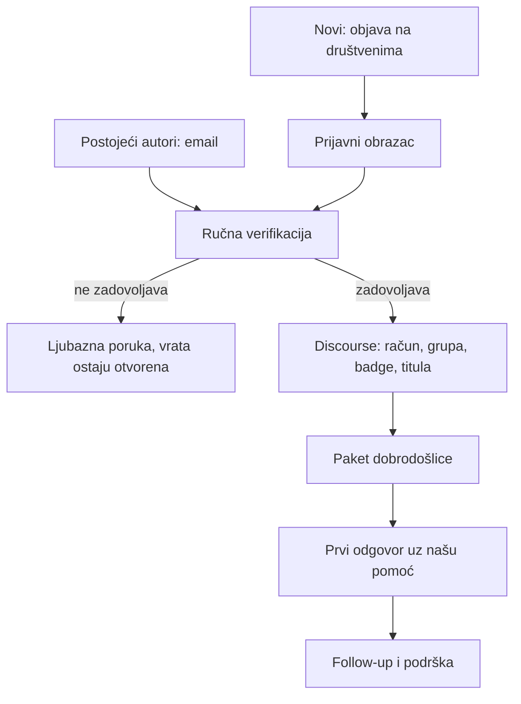

# Onboarding autora na forum

Ovo je interni vodič kroz cijeli proces, od prvog kontakta do trenutka kad autor objavi prvi odgovor. Cilj je da svaki autor prođe isti put, bez obzira dolazi li s našeg postojećeg foruma ili preko društvenih mreža.

Tražimo provjerene stručnjake koji žele pomagati ljudima jasnim i pouzdanim zdravstvenim informacijama. Otvoreni smo za sve koji žele biti dio zdravije zajednice, ali svakoga ručno provjerimo prije nego dobije oznaku.

Svi predlošci poruka su u [komunikacijski-predlosci.md](komunikacijski-predlosci.md), pitanja prijave u [prijavni-obrazac.md](prijavni-obrazac.md), paket koji se šalje autoru u [paket-za-autora.md](paket-za-autora.md), a kontrolna lista po autoru u [onboarding-checklist.md](onboarding-checklist.md).

## Dvije ulazne točke, jedan tijek

Imamo dvije skupine autora, ali oboje prolaze istu verifikaciju i dalje isti put.

- postojećih petnaestak autora s trenutnog foruma kontaktiramo emailom
- nove tražimo objavama na društvenim mrežama, a oni se javljaju preko prijavnog obrasca.

## Faze

### 1. Kontakt i poziv

Postojeće autore kontaktiramo emailom i ukratko objasnimo ideju zajednice i ulogu verificiranog stručnjaka. Za nove objavljujemo poziv na društvenim mrežama koji vodi na prijavni obrazac. Tekstovi za oboje su u predlošcima.

### 2. Prijava

Sve prijave skupljamo kroz isti obrazac da podaci budu na jednom mjestu. Tražimo ime, struku, titulu, link završnog rada, email, područja interesa i kratko zašto se žele pridružiti. Postojeće autore koje već znamo možemo provesti kroz obrazac ili podatke unijeti umjesto njih.

### 3. Verifikacija

Ovo je ručni korak i radimo ga prije ikakve oznake. Provjeravamo:

- struku i titulu
- link završnog rada kao dokaz
- da je osoba stvarno ona za koju se predstavlja.

Ako nešto nedostaje, ljubazno zatražimo dopunu. Ako osoba ne zadovoljava kriterij, javimo joj se uljudno i ostavljamo vrata otvorenima za ubuduće.

### 4. Odobrenje i Discourse postavljanje

Kad je osoba potvrđena, slažemo joj status na forumu. Redoslijed je namjerno ovakav da autor odmah po ulasku vidi svoju oznaku.

1. Pošalji pozivnicu za kreiranje računa ili poveži postojeći račun.
2. Dodaj korisnika u grupu "Verificirani stručnjaci".
3. Dodijeli badge "verificirani stručnjak".
4. Postavi titulu koja odgovara struci, na primjer "magistra farmacije".
5. Provjeri trust level da može normalno objavljivati i postavljati linkove.

### 5. Paket dobrodošlice

Tek kad je status postavljen, šaljemo [paket-za-autora.md](paket-za-autora.md). U njemu je sve što autoru treba za prvi odgovor: vodič za pisanje, markdown osnove, objašnjenje badgea i titule te smjernice zajednice.

### 6. Prvi odgovor

Pomognemo autoru da nađe pitanje na koje se može javiti i ponudimo se za pomoć oko prvog odgovora. Cilj je da prvi post prođe glatko i da se osjeća sigurno.

### 7. Follow-up i podrška

Nakon prvog odgovora se javimo, zahvalimo i ponudimo pomoć dalje. Sudjelovanje je dobrovoljno, bez kvota. Autori se javljaju kad imaju vremena i znanja za temu.

## Što očekujemo od autora

- da pišu iz svoje struke i onoga što stvarno znaju
- da su točni i da upute na liječnika kad je to potrebno
- da poštuju ton zajednice opisan u vodiču.

Bez obaveza i bez kvota. Kvaliteta je ispred količine.
